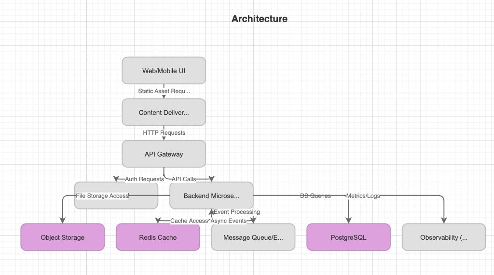
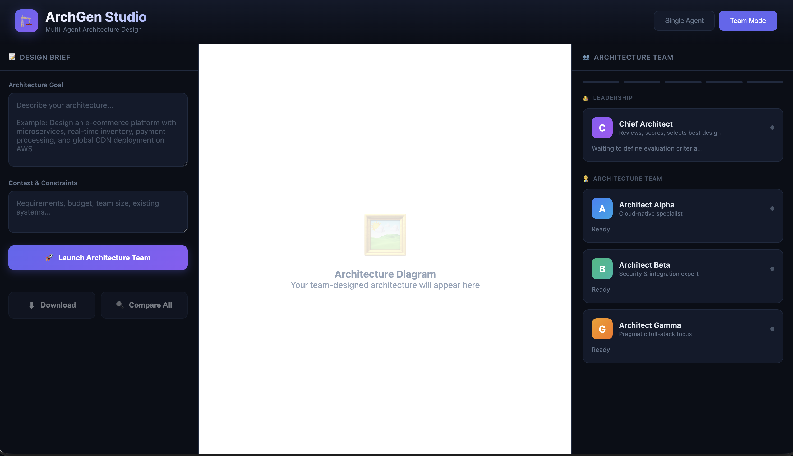
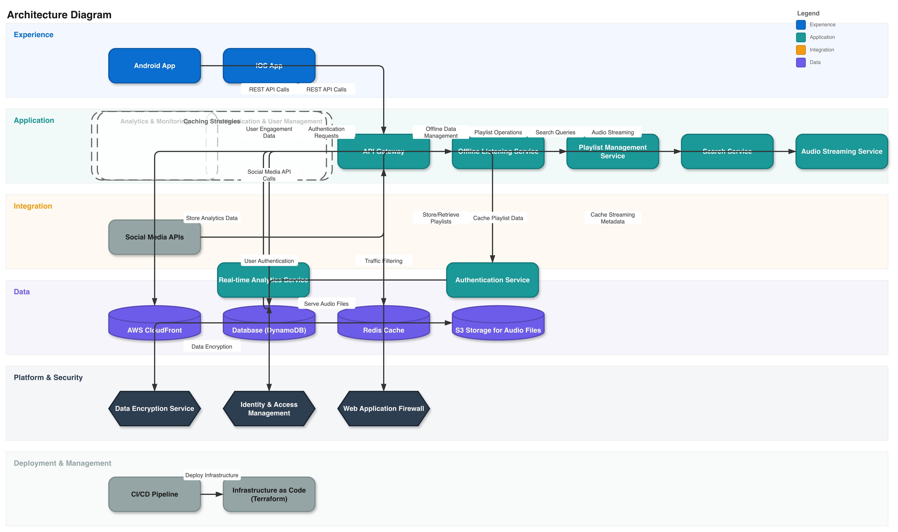

# ArchGen - Multi-Agent Architecture Studio

A professional AI-powered architecture design tool that uses a team of specialized AI architects to collaboratively create compelling Draw.io diagrams.


## Features

### Multi-Agent Architecture Team

- **Chief Architect** - Sets evaluation criteria, reviews all proposals, scores and selects the best design
- **Architect Alpha** - Cloud-native specialist (microservices, Kubernetes, serverless, AWS/Azure)
- **Architect Beta** - Security & integration expert (zero-trust, compliance, API governance)
- **Architect Gamma** - Pragmatic full-stack focus (simplicity, maintainability, DevX)

### Collaborative Workflow

```
1. Chief Architect defines evaluation criteria
              ↓
2. All 3 architects design independently
              ↓
3. Peer review phase (each reviews others)
              ↓
4. Chief Architect scores all proposals
              ↓
5. Winner refined based on feedback
              ↓
6. Best architecture presented as Draw.io
```

### Professional UI

- Real-time agent status visualization
- Progress tracking across 5 phases
- Peer review scores displayed live
- Winner announcement with reasoning
- Compare all proposals side-by-side
- Download as .drawio file

## Installation

### Prerequisites

- Python 3.10 or higher
- OpenAI API key

### Setup

1. **Clone the repository**
```bash
git clone https://github.com/allthingssecurity/archagents.git
cd archagents
```

2. **Create virtual environment**
```bash
python3 -m venv .venv
source .venv/bin/activate  # On Windows: .venv\Scripts\activate
```

3. **Install dependencies**
```bash
pip install -r requirements.txt
```

4. **Configure API key**
```bash
# Create .env file
echo "OPENAI_API_KEY=your-openai-api-key-here" > .env
```

5. **Run the server**
```bash
python -m archgen.server
```

6. **Open in browser**
```
http://127.0.0.1:8000
```

## Usage

### Team Mode (Multi-Agent)

1. Enter your architecture goal in the text area
2. Optionally add context and constraints
3. Click **"Launch Architecture Team"**
4. Watch the agents collaborate in real-time
5. Download the winning architecture as .drawio

### Single Agent Mode

1. Toggle to "Single Agent" mode
2. Enter your architecture goal
3. Click **"Generate Architecture"**
4. The single agent iteratively designs and validates

### MCP Live Mode (NEW!)

Build diagrams directly in Draw.io in real-time using the [drawio-mcp-server](https://github.com/lgazo/drawio-mcp-server).

#### Prerequisites for MCP Mode

1. **Install and run the MCP server:**
```bash
npx -y drawio-mcp-server --transport http --http-port 3000
```

2. **Install the Draw.io browser extension:**
   - Visit [Draw.io MCP Extension](https://github.com/lgazo/drawio-mcp-extension)
   - Install in Chrome/Firefox

3. **Open Draw.io in your browser:**
   - Go to [app.diagrams.net](https://app.diagrams.net)
   - Create a new diagram
   - Ensure the extension is connected (you'll see a status indicator)

4. **Use MCP Live mode:**
   - Toggle to "🎨 MCP Live" in the ArchGen Studio
   - The MCP status indicator should show "Connected"
   - Enter your architecture goal
   - Click **"Build in Draw.io"**
   - Watch the diagram being built live in your Draw.io tab!

### Example Prompts

```
Design an e-commerce platform with microservices, real-time inventory,
payment processing, and global CDN deployment on AWS

Design a healthcare data platform with HIPAA compliance, real-time
patient monitoring, and integration with EHR systems

Design a data layer with PostgreSQL, Redis cache, and object storage 
for files, plus message queue for async workflows. Add observability 
(centralized logs, metrics, tracing), CI/CD pipeline, and secrets 
management. Show network/security boundaries (VPC, private subnets, 
WAF, TLS) and label key request + async event flows.
```

### Example Output



*A clean architecture diagram showing data layer with PostgreSQL, Redis, Object Storage, Message Queue, and Observability components with clear data flow arrows.*

## Project Structure

```
archgen/
├── __init__.py           # Package marker
├── server.py             # FastAPI server with endpoints
├── agent.py              # Single-agent architecture generation
├── multi_agent.py        # Multi-agent team orchestration
├── mcp_client.py         # Draw.io MCP server client (NEW!)
├── mcp_agent.py          # MCP-enabled architecture agent (NEW!)
├── plan_to_drawio.py     # Plan → Draw.io XML conversion
├── render.py             # XML → SVG rendering
├── validate.py           # Architecture validation
├── requirements.txt      # Python dependencies
├── static/
│   └── index.html        # Professional web UI
└── README.md             # This file
```

## API Endpoints

| Endpoint | Method | Description |
|----------|--------|-------------|
| `/` | GET | Serve the web UI |
| `/api/health` | GET | Health check |
| `/api/generate_stream` | POST | Single-agent streaming generation |
| `/api/multi_agent_stream` | POST | Multi-agent team generation |
| `/api/clarify` | POST | Get clarifying questions |
| `/api/export` | POST | Export XML to SVG/PNG |
| `/api/mcp/status` | GET | Check MCP server connection status |
| `/api/mcp/generate_stream` | POST | Generate architecture via MCP (live in Draw.io) |
| `/api/mcp/call_tool` | POST | Directly invoke an MCP tool |
| `/api/mcp/build_diagram` | POST | Build a diagram from a plan via MCP |
| `/api/mcp/tools` | GET | List available MCP tools |

## Configuration

Environment variables:

| Variable | Description | Default |
|----------|-------------|---------|
| `OPENAI_API_KEY` | OpenAI API key | Required |
| `ARCHGEN_OPENAI_MODEL` | Model to use | `gpt-4o-mini` |
| `HOST` | Server host | `127.0.0.1` |
| `PORT` | Server port | `8000` |
| `DRAWIO_MCP_URL` | Draw.io MCP server URL | `http://localhost:3000` |

## Architecture Layers

The generated diagrams follow enterprise architecture conventions:

| Layer | Color | Purpose |
|-------|-------|---------|
| Experience | Blue (#0a6ed1) | User interfaces, portals, mobile apps |
| Application | Teal (#1a9898) | Business logic, core applications |
| Integration | Orange (#f39c12) | APIs, events, orchestration |
| Data | Purple (#6c5ce7) | Storage, analytics, data lakes |
| Platform & Security | Dark (#2c3e50) | Infrastructure, identity, security |
| External | Gray (#95a5a6) | Third-party systems |

## How It Works

### Multi-Agent Collaboration

1. **Chief Architect** analyzes requirements and defines weighted evaluation criteria (scalability, security, maintainability, cost-efficiency, innovation)

2. **Each Architect** independently designs an architecture based on their specialty:
   - Alpha focuses on cloud-native patterns
   - Beta emphasizes security and integration
   - Gamma prioritizes simplicity and operations

3. **Peer Review** - Each architect reviews the others' designs, providing:
   - Strengths (what works well)
   - Weaknesses (areas of concern)
   - Suggestions (specific improvements)
   - Score (1-10)

4. **Chief Scoring** - Evaluates all proposals against criteria, computes weighted scores, selects winner

5. **Refinement** - Winner incorporates feedback from peers and chief for final design

### Output Format

Generated architectures are exported as Draw.io XML (mxGraphModel), which can be:
- Opened directly in draw.io
- Rendered as SVG in the browser
- Downloaded as .drawio file

## Development

### Running in Development Mode

```bash
# With auto-reload
uvicorn archgen.server:app --reload --host 127.0.0.1 --port 8000
```

### Using a Different Model

```bash
export ARCHGEN_OPENAI_MODEL=gpt-4o
python -m archgen.server
```

## License

MIT License - feel free to use and modify.

## Contributing

Contributions welcome! Please open an issue or PR.

---

Built with FastAPI, OpenAI, and vanilla JavaScript.

## Screenshots

- Landing Page



- Architecture (Scalable Audio Streaming on AWS)



## Scenario: Scalable Audio Streaming on AWS

This architecture demonstrates a scalable audio streaming platform deployed on AWS, generated via the agentic flow:
- API and Ingestion Tier with global access and CDN
- Stream processing for transcoding and packaging
- Storage layers (hot/cold) with lifecycle policies
- Playback and session control
- Monitoring, logging, and tracing across the stack
- Security boundaries for public/private subnets, IAM, and encrypted data flows

The diagram was produced by the iterative plan → synthesize → validate → refine loop.
